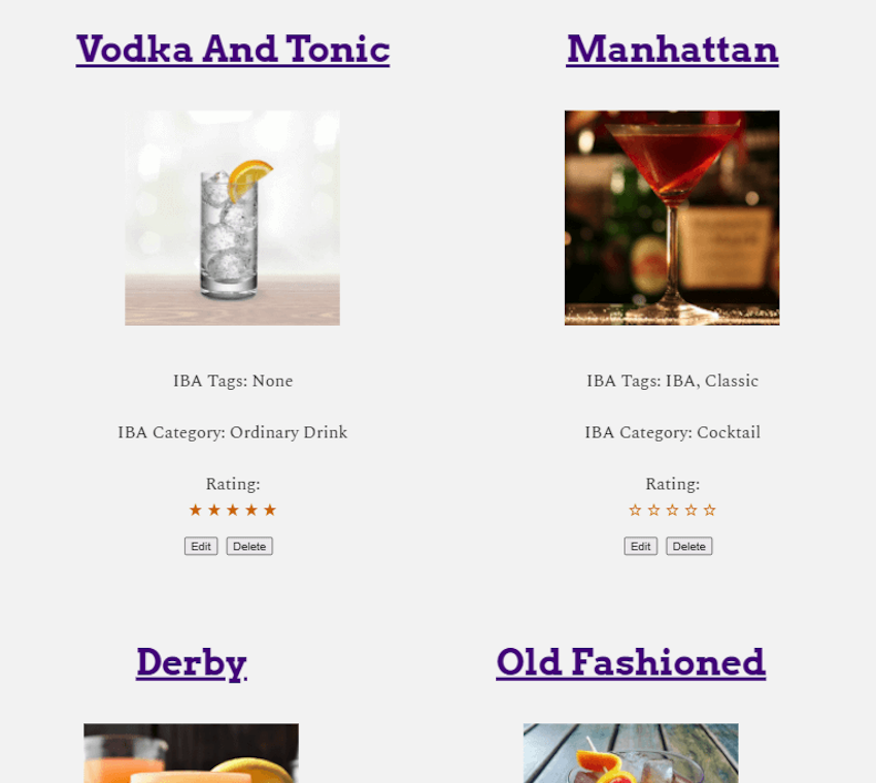
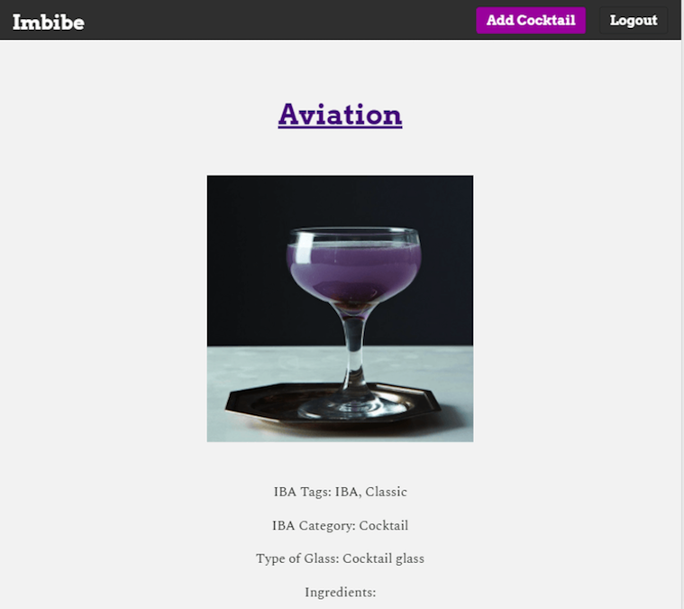
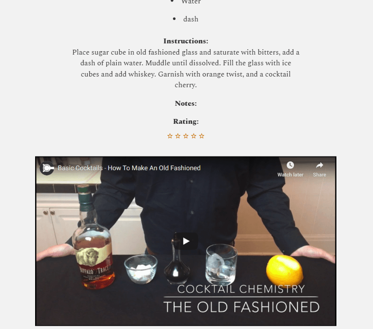

# Imbibe

## Summary

Imbibe gives you instantaneous information and recipes for cocktails. Each user can curate a custom drink menu of old favorites and new discoveries to try. Utilizing the Cocktail Database API to retrieve cocktail data on the Imbibe server, the user can search by cocktail name and receive a listing of ingredients, instructions, IBA (International Bartender Association) info, an image of the cocktail and, for certain drinks, a YouTube tutorial on how to mix the drink. In addition, the user can add their own personal notes and ratings for each drink.

## Live Site

- [Link](https://imbibe.vercel.app/) to view it in the browser.
- [Link](https://github.com/rogtang/imbibe-app-client) to view the client built with React.js.

## Endpoints
- /api/drinks
    - GET (GETs all drinks from the logged-in user)
- /api/drinks/:post_id
    - GET (GETs an individual drink from the logged-in user)
    - DELETE (DELETEs an individual drink post from the logged-in user)
    - PATCH (Edits an individual drink post from the logged-in user)
- /api/drinks/search/:search_drink
    - GET (GETs the name of the user's drink query, requests the drink data from the Cocktail DB API, and inserts the drink data into the Imbibe Posts table)
- /api/users
    - GET (GETs all users stored in the Imbibe Users database)
    - POST (Adds a new user in the Imbibe Users database)
- /api/auth/login
    - POST (Authenticates an existing user in the Imbibe Users database)

## Screenshots

- Landing Page:
  
  
- Dashboard/Menu:
  
  
- Cocktail Info:
  
  
- Adding a Cocktail:
  

## Built With (Server-side):

- Node.js
- Express.js
- Knex.js (SQL Query Builder)
- PostgreSQL
- Supertest (Testing)
- Mocha (Testing)
- Chai (Testing)

## Scripts

Install node modules `npm install`

Start the application `npm start`

Start nodemon for the application `npm run dev`

Run the tests `npm test`